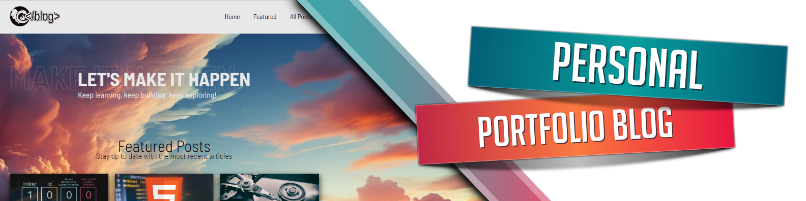

# Portfolio Blog

### Languages and Tools used in this project

 

### Additional Info

  WIP! Blog page setup with 11ty, a static site generator. Along with the Netlify CMS, to publish new blog posts through an admin panel without touching any actual code. I will be updating the blog while learning more on my journey as a Front End Developer.
  <a href="https://lux-portfolio-blog.netlify.app/">Link to the live website on my personal domain</a>

